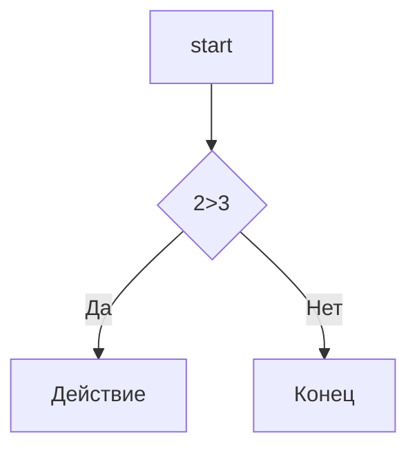

# repositoriu
# Заголовок 1
## Заголовок 2
### Заголовок 3
#### Заголовок 4
##### Заголовок 5
###### Заголовок 6

Выделение текста
----------------
*Курсив* / _Курсив_

**Жирный** / __Жирный__

***Жирный и Курсив*** / ___Жирный и Курсив___

~~зачеркнутый~~

`моноширинный код`

Списки
-----
- Пункт 1
- Пункт 2
  - Вложенный
  - ещё
* Пункт 3
+ Пункт 4

1. Первый
2. Второй
3. Третий
   1. Вложенный
   2. ещё

- [x] 1
- [ ] 2
- [ ] 3

Ссылки
------

[текст ссылки](https://example.com)
[С подсказской](https://example.com "При наведении")

<https://auto-link.com>

[Ссылочный стиль][1]

[1]: https://example.com

Картинка
-------


[

Цитата
-----

>Цитата
>
>Много строк
>
> > Вложеная

Код
---
```markdown
print("Hello") Python
```

```python
c = a+b
print(f"{c} = {a} + {b}
```

Таблицы
----

---: = ориентация справа

:---: ориентация по центру

:--- - ориентация слева

| Name | Age | City       |
|-----:|:---:| :----------|
|SS    |34   |   MOd      |
|SS    |34   |   MOd      |
|SS    |34   |   MOd      |
|SS    |34   |   MOd      |
|SS    |34   |   MOd      |

Линии
---

---
***

___

Экранирование
----

\# fdf

\[ askdaskd \]

Диаграмма
-------



Заголовки
-----

- [Заголови](#1-заголовки)
- [Списки](#3-списки)
